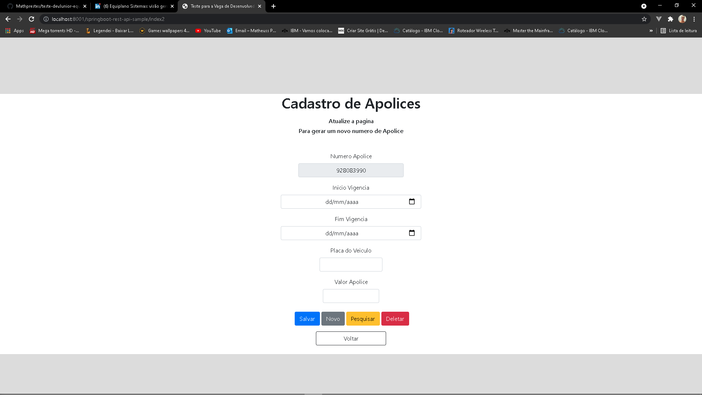
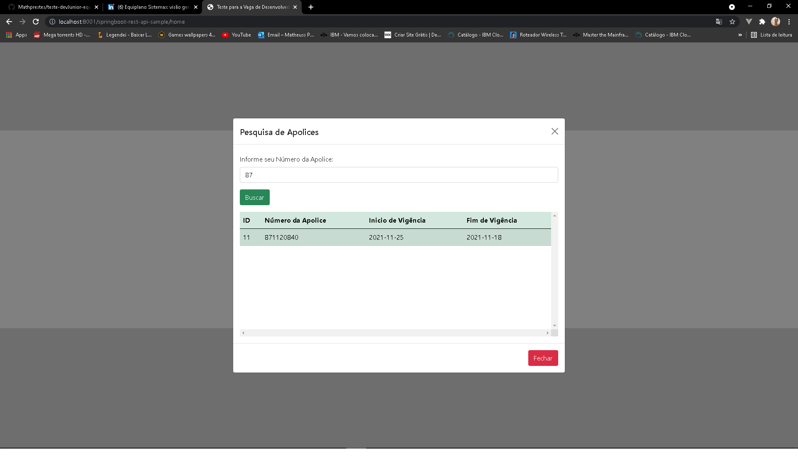

# TESTE PARA A VAGA DE DESENVOLVEDOR JUNIOR JAVA
## Projeto completo - Matheus Gouveia Prestes -

-------------------------------------

A estrutura do meu banco de dados está definida assim.
Muito simples, so criar uma "database" chamada "seguradora-veiculos" somente isso.

⚠️ "spring.datasource.url=jdbc:postgresql://localhost:5432/seguradora-veiculos" ⚠️

Aqui estão definidos a URL de acesso ao projeto
Asism que criar o banco, só ir na pasta principal do projeto, e rodar como "Java Application".
Feitos isso, basta somente colocar essa url no navegador de sua preferencia.

> ⚠️ O servidor iniciará na porta 8001 / springboot-rest-api-sample ⚠️
Acesse <http://localhost:8001/springboot-rest-api-sample/>

### Tecnologias Usadas

  

 

## :eye_speech_bubble: **Telas*

### :desktop_computer: Computador

|Desktop|Desktop|
|:---:|:---:|
|<kbd></kbd>|<kbd></kbd>

|Desktop|Desktop|
|:---:|:---:|
|<kbd></kbd>|<kbd></kbd>

|Desktop|Desktop|
|:---:|:---:|
|<kbd></kbd>|<kbd></kbd>

-----------------------------------

